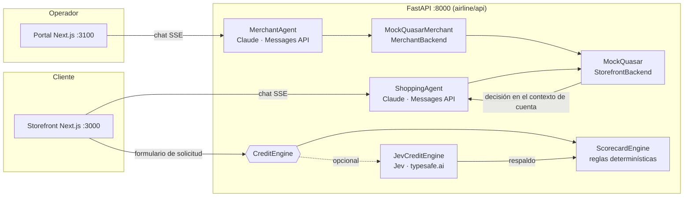

# Quasar Airlines · Airfintech commerce agents

Prototipo de **comercio agéntico** para una aerolínea que vende vuelos, ancillaries y
productos financieros en una sola conversación. Dos agentes sobre el framework
[`anthropics/commerce-agents`](https://github.com/anthropics/commerce-agents):

- **Asistente Quasar** (storefront, cliente): busca vuelos con fecha, compara cabinas,
  vende ancillaries (maletas, asiento, embarque prioritario, sala VIP), millas, seguro de
  viaje y cuotas (Quasar Pay), y lleva a un cliente sin tarjeta por la **solicitud de la
  tarjeta co-branded Quasar Visa**: evaluación de crédito, nivel recomendado, cupo y alta en
  el carrito, en el mismo flujo de compra.
- **Asistente de operaciones** (portal, operador comercial): lee load factor, attach rate,
  ingreso ancillary por pasajero, ingreso fintech y el portafolio de tarjetas y seguros;
  detecta cabinas casi llenas o que no se llenarán antes de salir; prepara movimientos de
  tarifa, promociones y campañas que solo se aplican con aprobación humana.

> Quasar Airlines, Banco Andino Digital y todas las personas, productos y cifras son
> ficticios. Nada emite un tiquete, cobra una tarjeta ni aprueba un crédito real.

## La idea

El booking deja de ser el final del embudo. Cada búsqueda de vuelo es una oportunidad de
**ancillary revenue** y de **adquisición bancaria**: el agente cotiza la tarifa, detecta que
el cliente no tiene la tarjeta co-branded, le muestra el costo real de financiar el viaje con
y sin ella, y cierra la solicitud en el mismo chat. Del lado operativo, el mismo catálogo
alimenta al revenue manager con las señales para mover tarifas y dirigir campañas a cohortes
(viajeros frecuentes sin tarjeta, titulares Classic con upgrade potencial, pasajeros sin
maleta prepagada).

## Arquitectura



Principios que el framework impone y el prototipo respeta:

- **Un modelo dueño de la conversación.** Claude razona, busca, compara y presenta; los datos
  y las escrituras pasan por un backend tipado (`StorefrontBackend`, `MerchantBackend`).
- **La UI son llamadas a herramientas de presentación** validadas y completadas en el
  servidor: la matriz de cabinas o de niveles de tarjeta, el cuadro de condiciones, el
  formulario de solicitud y la tarjeta de decisión de crédito se llenan desde el backend,
  nunca con cifras escritas por el modelo.
- **Gates en código.** Contenido de terceros aislado (fencing), provenance en el carrito,
  topes de cantidad y de movimiento de precio, grounding de políticas y órdenes.
- **La decisión de crédito no es del LLM.** El formulario va del navegador al motor de
  crédito sin pasar por el modelo; Claude solo lee el resultado. `add_to_cart` rechaza un
  nivel de tarjeta que la evaluación no aprobó, diga lo que diga el chat.
- **Aprobación humana en el portal.** Los cambios del operador quedan preparados y solo se
  aplican con el botón Aprobar; tasas y cuotas de productos regulados no se pueden mover.

## Motor de decisión de crédito

`airline/api/credit.py` define la solicitud, el registro de buró, la evaluación y el
protocolo `CreditEngine`. Hay dos motores:

| Motor | Qué decide | Cuándo se usa |
|---|---|---|
| `ScorecardEngine` (`scorecard-v1`) | Knock-outs (menor de 18, más de 2 moras en 24 meses, deuda/ingreso > 45 %), puntos por buró, endeudamiento, antigüedad y uso de crédito; pisos de puntaje e ingreso por nivel (Classic 650 / $1,200, Gold 700 / $2,500, Platinum 750 / $5,000); cupo; nivel recomendado por perfil de viaje. | Por defecto, y siempre como respaldo. |
| `JevCreditEngine` (`scorecard+jev-v1`) | El scorecard, más juicios de **Jev** (System One de typesafe.ai) en una sola llamada en paralelo. | Con `QUASAR_CREDIT_ENGINE=jev` y `TYPESAFE_API_KEY`. |

### Rol de Jev y cómo interactúa con Claude

Jev no conversa ni decide la política: devuelve **juicios tipados con probabilidad y
confianza** sobre la solicitud, que el código combina con pesos acotados:

| Pregunta a Jev | Primitiva | Uso en código |
|---|---|---|
| `repayment_capacity` | Score (5 niveles) | Mueve el puntaje del scorecard hasta ±40 puntos. |
| `income_stability` | Score (4 niveles) | Mueve el puntaje hasta ±20 puntos. |
| `application_consistency` | Noul | ≥ 0.6: la solicitud pasa a revisión manual. |
| `fit_classic`, `fit_gold`, `fit_platinum` | Score comparable por nivel | Elige el nivel recomendado entre los aprobados. |

- Los knock-outs, los pisos por nivel y el cupo siguen en código: Jev puede mover a un
  solicitante en el límite, nunca saltarse una regla.
- Error, timeout (4 s) o confianza < 0.55 devuelven la decisión del scorecard con
  `fallback_used: true`; el storefront nunca espera ni falla por Jev.
- Jev no recibe el año de nacimiento ni atributos protegidos (género, nacionalidad, estado
  civil no se recolectan).
- **Claude y Jev no se llaman entre sí.** Jev juzga (System One: decisiones rápidas y
  calibradas); Claude razona y conversa (explica la decisión, compara niveles, calcula el
  costo de las cuotas y agrega la tarjeta aprobada). El backend es el único punto donde se
  encuentran: la evaluación queda en la sesión y Claude la lee del contexto de cuenta.

### Activar Jev

```bash
.venv/bin/pip install -r requirements-jev.txt
```

En `.env`:

```bash
QUASAR_CREDIT_ENGINE=jev
TYPESAFE_API_KEY=...        # console.typesafe.ai
QUASAR_JEV_MODEL=jev-latest # opcional
```

Reinicia el API. La tarjeta de decisión muestra el motor usado (`scorecard+jev-v1`) y los
motivos marcados como "evaluada por Jev". Sin esas variables, o si falta el paquete, decide
el scorecard. Las pruebas del motor (`airline/api/tests/test_jev_engine.py`) usan un cliente
simulado; calibra umbrales y pesos con tus propios casos antes de usarlo en serio.

## Ejecutar

Requisitos: Python 3.11+ y Node 22+.

```bash
python3.12 -m venv .venv
.venv/bin/pip install -r requirements-dev.txt
npm install
cp .env.example .env            # agrega ANTHROPIC_API_KEY
```

```bash
.venv/bin/uvicorn airline.api.main:app --app-dir . --port 8000
```

```bash
npm run dev -w airline/storefront-web      # http://localhost:3000
```

```bash
npm run dev -w airline/merchant-web        # http://localhost:3100
```

Verificación:

```bash
.venv/bin/ruff check . && .venv/bin/ruff format --check . && .venv/bin/pytest
```

## Demo

Los guiones validados contra el modelo real, con el resultado que garantiza el backend en cada
paso, están en [`airline/README.md`](airline/README.md#batería-de-demo): Mateo (sin tarjeta,
solicitud y aprobación), Valentina (titular Gold, ancillaries y upgrade a Platinum) y el portal
de operaciones (attach, cabinas, promoción con aprobación, portafolio, rechazos regulados).

## Estructura

```
airline/
  api/            host FastAPI, backends, configs, motor de crédito (scorecard y Jev),
                  herramientas de presentación, pruebas
  data/           fixtures: catálogo, perfiles, reservas, políticas, cuentas, operación
  skills/         flujos del shopping agent y del merchant agent (del framework)
  storefront-web/ app del cliente (Next.js)
  merchant-web/   portal del operador (Next.js)
demo_common/      rutas, sesiones y utilidades del host (del framework, con cambios locales)
web-shared/       kit web compartido (del framework)
CLAUDE.md         registro de decisiones del agente
```

## Stack

Claude (`claude-sonnet-5`) sobre la Messages API · `anthropics/commerce-agents` ·
FastAPI · Next.js 16 · Tailwind 4 · Jev (typesafe.ai, opcional) · pytest · ruff.

## Atribución y licencia

Construido sobre [`anthropics/commerce-agents`](https://github.com/anthropics/commerce-agents)
de Anthropic PBC (Apache-2.0): los paquetes `commerce-common`, `shopping-agent` y
`merchant-agent`, `demo_common/` y `web-shared/` (adaptados), los skills de ambos agentes, y
la vertical telecom como punto de partida de la API y las apps. El detalle está en
[`NOTICE`](NOTICE). Este proyecto se distribuye bajo la licencia [Apache-2.0](LICENSE).
